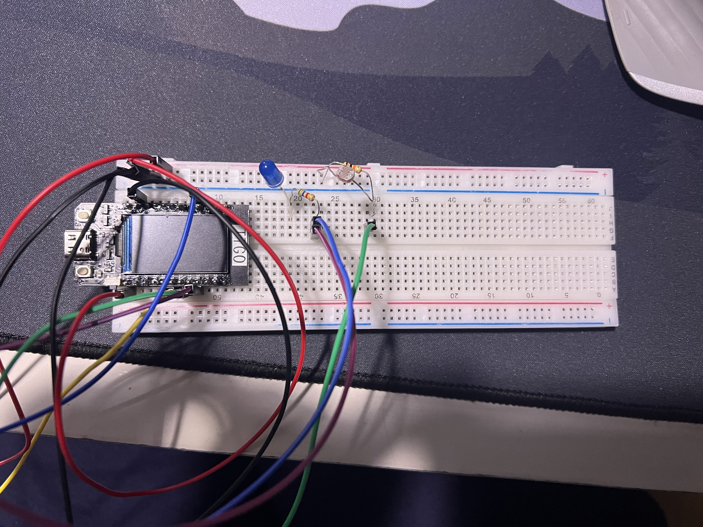
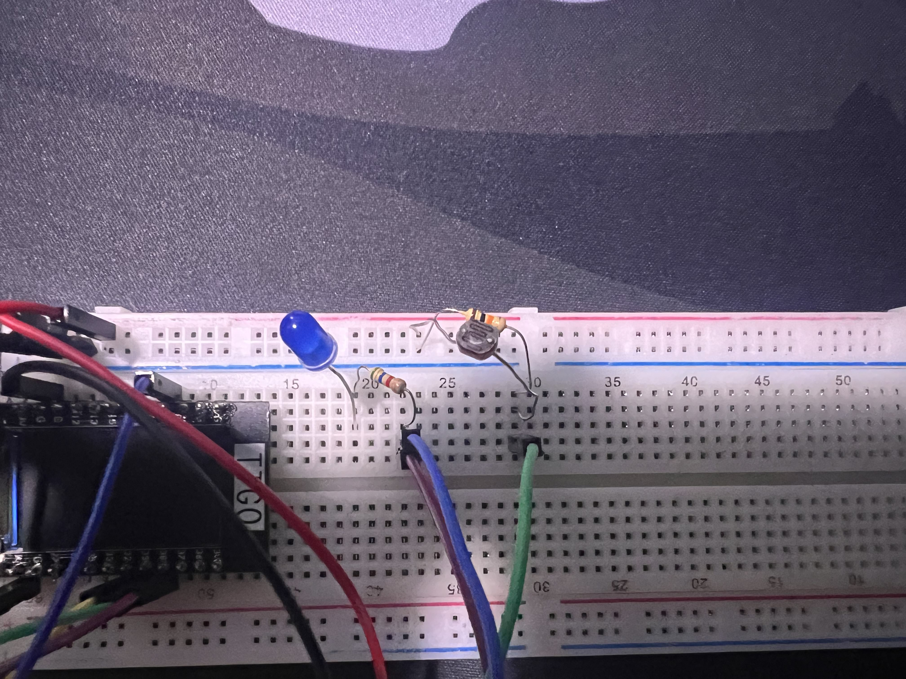

# IoT-Lab0 (by Sophia Canja & Sovial Sonzeu)

## Youtube link to demo video
https://www.youtube.com/watch?v=BY9bZ_YQzgc

## Source files changed are: 
 main.cpp, platform.ini
 
## main.cpp file location:
IoT-Lab0/Lab 0/src/main.cpp

## platform.ini file location:
IoT-Lab0/Lab 0/platformio.ini

## Images of Lab 0 Setup

